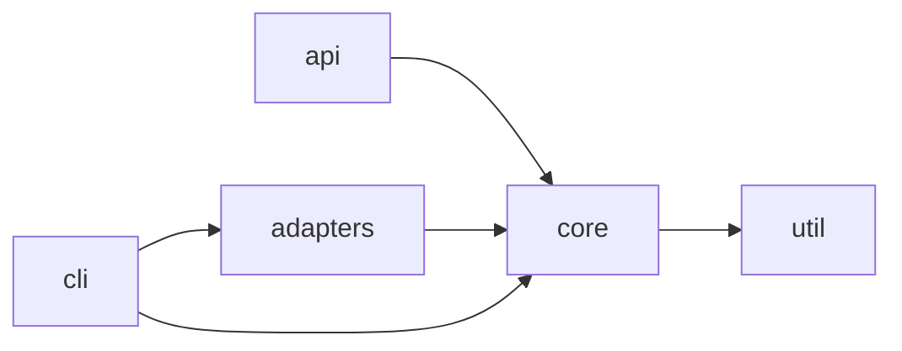

# Template: docs/architecture.md

The map an agent reads before changing anything structural. It says what the modules are, who owns what, and which way dependencies may point. It does not describe implementations (module READMEs), rationale (decisions), or status. Keep it under ~120 lines; a diagram is worth more than a paragraph here.

If the repo already has an architecture document, link it from the root and add only the *Dependency direction* section if missing — that section is what `verify-dependency-direction` (if you generate one) and the module READMEs' *Allowed dependencies* refer to.

---

```markdown
# Architecture

<<Two sentences: the shape of the system (e.g. "a CLI that drives a plugin host; plugins talk to core through a typed event bus") and the one design idea everything follows.>>

## Modules

| Module | Owns | Does not own |
| --- | --- | --- |
| `<<core/>>` | <<domain model, invariants, the event loop>> | <<I/O, transport, presentation>> |
| `<<adapters/>>` | <<translating external systems to core contracts>> | <<business decisions>> |
| `<<api/>>` | <<HTTP surface, auth, serialization>> | <<domain rules — it calls core>> |

Each module's contract is in its `README.md`; read it before editing.

## Dependency direction

Arrows mean "may import". Anything not drawn is forbidden.



- `<<core>>` imports nothing above it. A need for something from `<<api>>` inside `<<core>>` means a contract is missing in core, not an import.
- <<Any exception, with the decision that allows it.>>
- Enforced by `<<verify-dependency-direction / lint rule / import-linter config>>`.

## Runtime flow

<<One sequence for the main path — request in, decision made, side effect out — as a numbered list or a Mermaid sequence diagram. Name the modules in order. Skip if the system is a library.>>

## Extension points

Where new capability goes, so a feature does not become a new core dependency:

| Need | Extend | Not |
| --- | --- | --- |
| <<a new data source>> | <<`adapters/<name>` implementing `Source`>> | <<a branch in core>> |
| <<a new command>> | <<`cli/commands/<name>`>> | <<`main.rs`>> |

## Cross-cutting

- Configuration: <<where it loads, where defaults resolve, the one owner>>.
- Errors: <<the error type hierarchy and where errors become user messages>>.
- Logging / observability: <<the one logger, what is never logged (secrets, PII)>>.
- Persistence: <<the store, who writes it, migrations location>>.
```

---

## Notes for the generator

- Derive the module table from the survey; derive the dependency graph from actual imports. If the observed graph has cycles or upward imports, draw the *intended* graph and list each violation under a `## Known violations` section with a `TODO(owner)` — do not draw the mess as if it were the design.
- If a `uml-code-atlas` skill is available and the user wants more than a map, use it for the diagrams and link its output here rather than duplicating.
- Extension points are only worth listing when the repo has a plugin/adapter/handler pattern. Delete the section otherwise.
