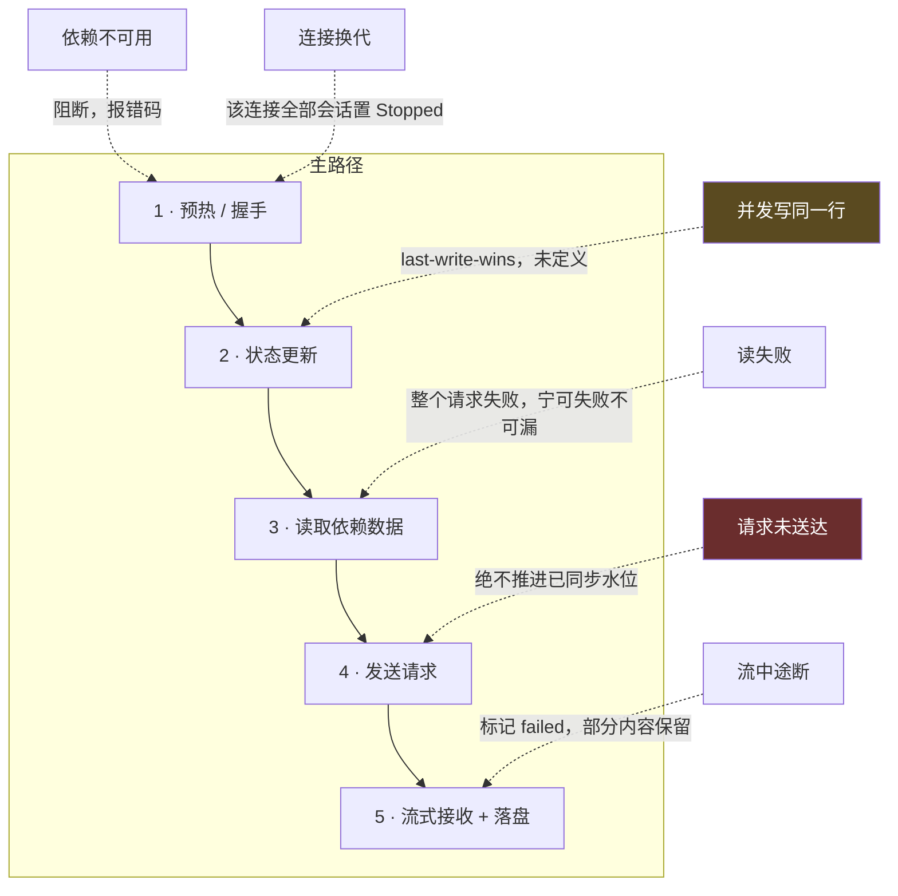
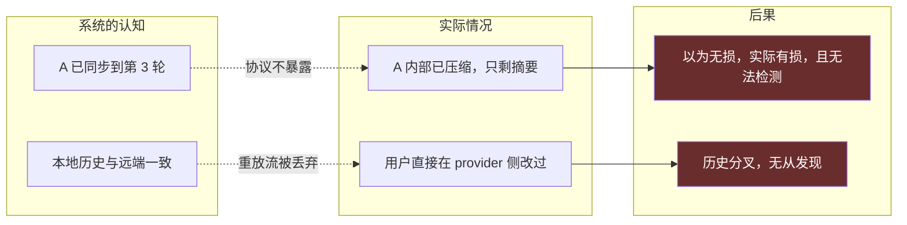
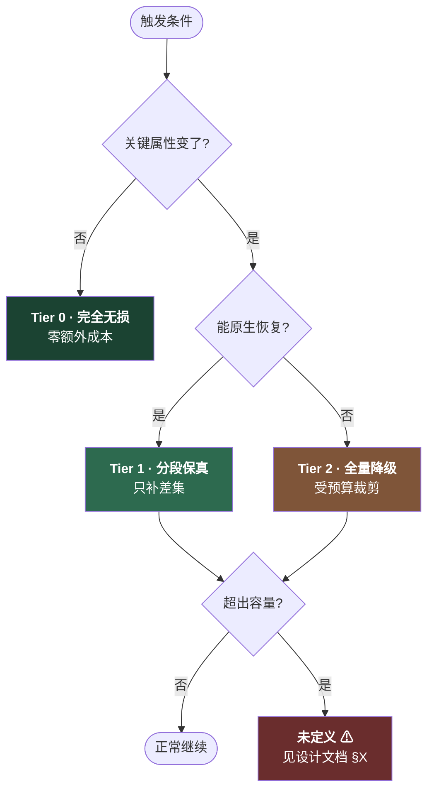
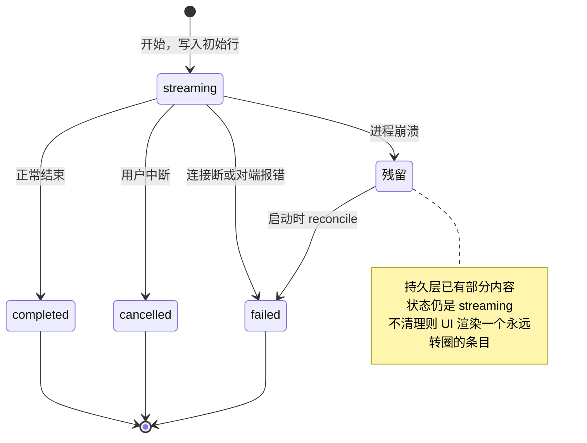

# Failure Analysis Method

Read this before writing the failure section of an atlas. Contents:

1. [Modes vs. scenarios](#1-modes-vs-scenarios)
2. [Where to find failure modes](#2-where-to-find-failure-modes)
3. [The detectability legend](#3-the-detectability-legend)
4. [Diagram 1 — failure injection panorama](#4-diagram-1--failure-injection-panorama)
5. [Diagram 2 — silent failures: belief vs. reality vs. impact](#5-diagram-2--silent-failures-belief-vs-reality-vs-impact)
6. [Diagram 3 — correct vs. wrong implementation](#6-diagram-3--correct-vs-wrong-implementation)
7. [Diagram 4 — degradation ladder](#7-diagram-4--degradation-ladder)
8. [Diagram 5 — crash recovery state machine](#8-diagram-5--crash-recovery-state-machine)
9. [The impact matrix](#9-the-impact-matrix)
10. [Scenario walkthrough template](#10-scenario-walkthrough-template)

---

## 1. Modes vs. scenarios

Keep these as two separate sections. They answer different questions and readers use them differently.

- **Failure mode** — *what can go wrong here.* Organized by location in the system. Answers "have we covered everything?" Used during design review.
- **Failure scenario** — *one concrete story, start to finish.* Organized by narrative. Answers "what actually happens to the user and the data?" Used to write tests.

The scenario section is where acceptance criteria come from, which is why it earns its length even though it partly repeats the mode section.

---

## 2. Where to find failure modes

In rough order of yield:

1. **Bug-fix commits inside a feature branch.** The author already hit these races. `fix(session): stop a warm session from being deleted while it is attached` is a mode, a scenario, and an acceptance criterion in one line.
2. **Doc comments that argue with themselves.** Any comment explaining why the *obvious* implementation is wrong is describing a failure mode. `Failing is the point: the alternative — rebuilding — would hand this caller a provider session while releasing the one the first attach is persisting.`
3. **Swallowed errors.** `let _ = ...`, bare `catch {}`, `unwrap_or_default()`, `.ok()`. Each is a decision that this failure is survivable. Ask whether it really is, and whether anyone would notice.
4. **Timeouts and bounds.** Every timeout is a failure mode with a number attached. Every bound (queue depth, pool size, retry cap) is a mode that fires under load.
5. **Anything derived that could also be stored** (and vice versa). Derived values that go stale are the richest source of silent corruption.
6. **Concurrency windows.** Any `await` between "decide" and "act" is a window. Ask what happens if a second caller arrives inside it.
7. **Recovery paths.** Startup reconciliation, generation rollover, cache invalidation. These run rarely and are tested least.
8. **Anything the design doc marks undefined, TODO, or "future work."** Draw it in red rather than omitting it.

---

## 3. The detectability legend

Use this exact legend, and state it under the matrix:

```
✅ 会报错或留痕 · ⚠ 部分可见 · ❌ 完全静默 · ☠ 会静默损坏数据
```

(Translate the words to the atlas's language; keep the symbols.)

The point of the grading is that **severity and detectability are independent axes**, and the combination that matters is low-detectability + high-impact. A failure that reliably raises an error is a bug someone will file. A failure that silently corrupts stored state is a design flaw that will be discovered months later by a confused user.

Rank the ❌ and ☠ rows explicitly, and for each one answer:

- Can it be detected at all with a reasonable change?
- What does mitigating it cost **now** versus **after it ships**? Schema columns and identity keys are the classic "cheap now, expensive later" cases — say so plainly, because that framing is what actually moves a reviewer.

---

## 4. Diagram 1 — failure injection panorama

Happy path down the middle, failures pointing in with dotted arrows labeled by their handling.



Color discipline: red = must be implemented correctly or data corrupts silently; yellow = known but undefined; default = handled.

The 要点 under this diagram should explain the *choices*, especially where the system deliberately chooses to fail loudly rather than degrade — "读不到就让整个请求失败，绝不能读不到就不注入，那会产生用户察觉不到的空洞."

---

## 5. Diagram 2 — silent failures: belief vs. reality vs. impact

Three parallel columns. This is the clearest way to show failures that raise nothing.



The dotted-arrow labels are the important part: they name *why* the system cannot see the discrepancy. That reason is what determines whether mitigation is possible.

Follow with a three-column table: 静默失败 / 可缓解程度 / 建议.

---

## 6. Diagram 3 — correct vs. wrong implementation

Use whenever a value can be computed two ways and one is subtly wrong. `rect` blocks in a sequence diagram put both in one picture, which is far more persuasive than prose.

```mermaid
sequenceDiagram
    autonumber
    participant BE as backend
    participant DB as store
    participant P as provider

    Note over BE,P: 场景 · 已同步到 2，历史到 6，准备补 3-6
    BE->>DB: 写入 turn seq=7
    BE->>P: 发送请求
    P--xBE: 连接断开，provider 从未收到

    rect rgb(90, 40, 40)
        Note over BE,DB: 错误做法 · 用推导值
        BE->>DB: SELECT MAX(seq) WHERE session=...
        DB-->>BE: 7（行已存在）
        Note over BE: 认为已同步到 7，下次 gap 为空，3-6 永久丢失且无人察觉
    end

    rect rgb(30, 60, 40)
        Note over BE,DB: 正确做法 · 显式列 + 送达确认
        Note over BE: 请求失败，不执行任何 UPDATE
        BE->>DB: 标记 turn seq=7 为 failed
        Note over BE: 仍为 2，下次 gap 为 3-6，最多重复一次，无害
    end
```



State the asymmetry explicitly in the 要点: **宁可漏更新（下次多做一次，无害），不能错误前进（漏做，产生察觉不到的空洞）。** Naming which direction of error is survivable is often the single most useful sentence in the whole atlas.

---

## 7. Diagram 4 — degradation ladder

When a system has quality tiers rather than binary success/failure, show what drops you to which tier.



Two things to call out in the 要点: which transitions are **cliffs** (a large quality drop the user cannot perceive), and any terminal node that is genuinely undefined in the design. The red box is not a drawing error — say so, because readers assume it is.

---

## 8. Diagram 5 — crash recovery state machine

Any entity with a `streaming` / `in-progress` state needs this, because process death leaves a state no normal transition produces.



Ask two questions the code usually hasn't: does the terminal-but-abnormal state (`failed`, `cancelled`) still count for downstream computations? And is there a startup reconciliation, or does the stale state just sit there?

---

## 9. The impact matrix

One table, every mode, sorted roughly by path order. Columns:

| # | 失败 | 触发 | 可检测 | 处理 | 残留风险 |
|---|---|---|---|---|---|
| 1 | 依赖不可用 | 进程未启动 | ✅ 报错 | 返回错误码 | 无 |
| 5 | 请求未送达 | 连接断 | ✅ 报错 | **不推进水位** | 写错则空洞 ☠ |
| 13 | 对端隐式压缩 | 对端内部策略 | ❌ | 无 | 以为无损实为有损 ☠ |

Rules that keep it useful:

- **可检测 uses the legend symbols**, not prose. The column is scannable or it is pointless.
- **处理 says what the system does**, not what it should do. Where the answer is "nothing", write **未定义** in bold rather than inventing a handler.
- **残留风险 is what survives correct handling.** "无" is a legitimate and common answer; a matrix where every row has residual risk is not being honest, it is being alarmist.
- Bold the rows that must be implemented exactly right. There are usually one to three.

---

## 10. Scenario walkthrough template

Pick 3–8 scenarios. Choose them for *design pressure*, not likelihood — the value is in testing whether the design holds, so a rare scenario that breaks an invariant beats a common one that's obviously handled. Lead with an index table so a reader can jump to the severe ones.

| # | 场景 | 考验的设计点 | 严重度 |
|---|---|---|---|
| S1 | 切换后首个 turn 中途对端崩溃 | 水位推进时机 | 高 |
| S2 | 网络断在请求送达之前 | 空洞防护 | **致命** |
| S5 | 两个客户端同时切换 | 并发控制（当前无） | **致命** |

Each scenario:

```markdown
### S1 · <一句话标题>

**触发**：<具体前置状态 + 用户动作 + 故障注入点>

<sequence diagram>

**用户看到**：<UI 层面的观察结果，一到两句>

**数据库最终状态**

| 表 | 内容 |
|---|---|
| ... | ... |

**关键判断**：<这个场景考验的那个决策，以及为什么选这一边。
说明两个方向的错误代价不对称在哪。>

**验收标准**
- [ ] <可直接写成测试的断言>
- [ ] <...>
```

The acceptance checklist is the deliverable. Write each item so someone could implement the test without rereading the scenario. If a scenario produces no checkable assertions, it wasn't a useful scenario.

When a walkthrough contradicts the design document — which happens more often than you'd expect, because walking a story end to end is stricter than describing a rule — say so in a blockquote right there, and repeat it in the atlas's closing findings section:

> 由此得出一条比设计文档 §5.3 更严的规则：水位只应在 turn 成功完成时推进，"注入成功即推进"那条应予取消。
